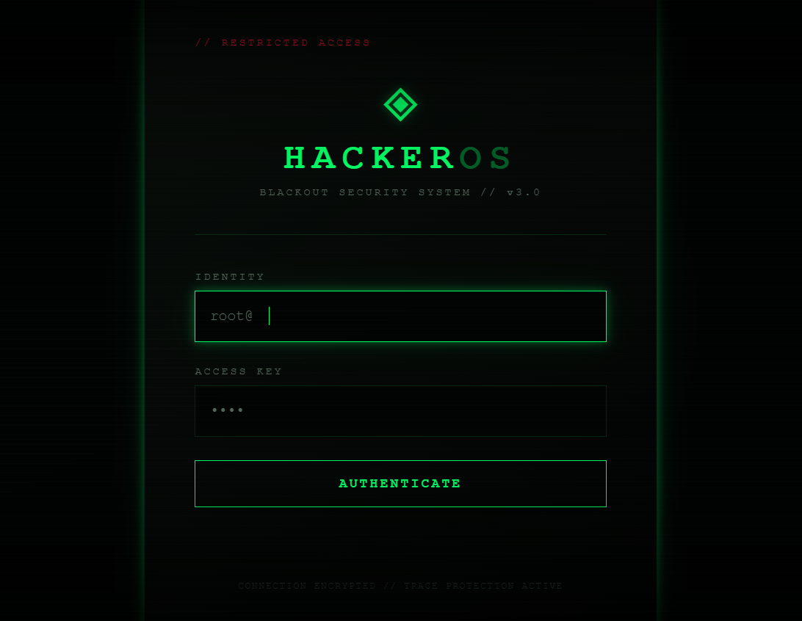
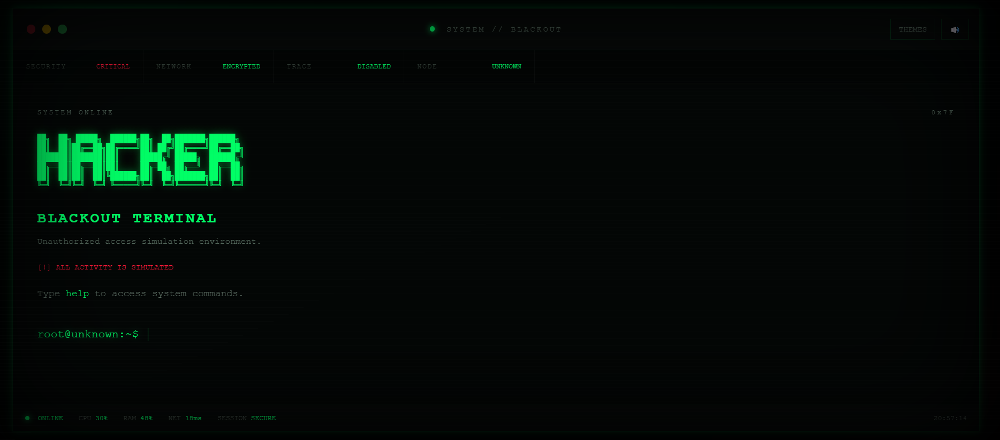

# 🖤 HackerOS Blackout


### 🖥️ Um terminal hacker cinematográfico criado com HTML, CSS e JavaScript.

O **HackerOS Blackout** é uma experiência web interativa inspirada em terminais hackers, interfaces de cibersegurança e sistemas operacionais fictícios.

O projeto simula um ambiente de terminal diretamente no navegador, com animação de inicialização, tela de login, sistema de arquivos virtual, comandos, monitoramento do sistema, temas e diversos efeitos visuais.

> ⚠️ **Aviso:** este projeto é totalmente fictício e foi desenvolvido para fins educacionais e de entretenimento. Nenhuma invasão, ataque, rastreamento ou acesso não autorizado é realizado de verdade.

---

## ⚡ Funcionalidades

* 🖥️ Terminal interativo
* 🔐 Sistema de login
* ⚙️ Inicialização animada do sistema
* 📁 Sistema de arquivos virtual
* 🌐 Sistema de rede simulado
* 💻 Diversos comandos de terminal
* 🔎 Simulação de análise de rede
* 💀 Simulação de ataque hacker
* 🟢 Modo Matrix
* 🎨 5 temas visuais
* ⌨️ Histórico de comandos
* 🔤 Autocompletar utilizando a tecla `Tab`
* 📊 Monitoramento fictício de CPU, RAM e rede
* ✨ Efeitos de glitch, scanlines e terminal
* 📱 Interface responsiva

---

## 🎨 Temas

O terminal possui diferentes estilos visuais:

| Tema       | Estilo                       |
| ---------- | ---------------------------- |
| 🟢 VOID    | Terminal hacker clássico     |
| ☢️ TOXIC   | Verde neon                   |
| 🔴 BLOOD   | Interface vermelha de perigo |
| 🟣 PHANTOM | Roxo escuro                  |
| 🔵 CYBER   | Azul cibernético             |

---

## 💻 Comandos disponíveis
=======
> A cinematic fake hacker terminal built with HTML, CSS and JavaScript.


## ⚡ Sobre

**HackerOS Blackout** é um terminal hacker fictício criado para simular uma interface de sistema avançada, com estética cyberpunk e diversas interações.

O projeto foi desenvolvido com **HTML, CSS e JavaScript puro**, sem frameworks ou bibliotecas externas.

> ⚠️ Todo o sistema é uma simulação visual. Nenhuma invasão ou atividade real é realizada.

## 🖥️ Funcionalidades

* 🔐 Tela de autenticação
* 🖤 Interface hacker totalmente temática
* ⚡ Animação de inicialização do sistema
* 💻 Terminal interativo
* 📂 Sistema de arquivos virtual
* 📝 Histórico de comandos
* ⌨️ Autocomplete com `TAB`
* 🟢 Matrix Mode
* 💀 Simulação de invasão
* 🔓 Simulação de acesso ROOT
* 🌐 Simulação de scanner de rede
* 📡 Topologia de rede fictícia
* 🔐 Sistema de descriptografia fictício
* 🎨 Sistema de temas
* 🔊 Controle de sons
* 📊 Monitoramento fictício de CPU, RAM e ping
* 🕒 Relógio em tempo real
* 📱 Interface responsiva

## 🎨 Temas

O HackerOS possui diferentes temas visuais:

| Tema    | Estilo             |
| ------- | ------------------ |
| VOID    | Verde neon sombrio |
| TOXIC   | Verde radioativo   |
| BLOOD   | Vermelho agressivo |
| PHANTOM | Roxo cyberpunk     |
| CYBER   | Azul neon          |

## ⌨️ Comandos


```text
help
clear
whoami
pwd
date
time
neofetch
history
ls
cd
cat
echo
scan
network
connect
disconnect
trace
decrypt
hack
sudo
secret
matrix
theme
sound
```


---

## 🔐 Sistema de acesso

Você pode utilizar qualquer nome de usuário.

### Senha
=======
## 🔐 Acesso

A senha padrão da simulação é:


```text
admin
```


---

## 🖼️ Demonstração

### 🔐 Tela de Login



### 🖥️ Terminal HackerOS



---

## 🛠️ Tecnologias utilizadas
=======
O usuário pode ser qualquer nome.

## 🛠️ Tecnologias


* HTML5
* CSS3
* JavaScript
<<<<<<< HEAD
* Manipulação do DOM
* Canvas API
* Web APIs

---

## 🚀 Como executar o projeto
=======
* Canvas API

## 🚀 Como executar


Clone o repositório:

```bash

git clone https://github.com/larissacalderan/hackeros-blackout.git
=======
git clone https://github.com/SEU-USUARIO/hackeros-blackout.git

```

Entre na pasta:

```bash
cd hackeros-blackout
```


Depois, abra o arquivo:
=======
Depois abra:


```text
index.html
```


diretamente no navegador.

Não é necessário instalar frameworks, bibliotecas ou dependências.

---

## 🎯 Objetivo do projeto

Este projeto foi desenvolvido para praticar e demonstrar conceitos de desenvolvimento Front-End, como:

* Criação de interfaces interativas
* Manipulação do DOM
* Lógica com JavaScript
* Animações com CSS
* Design responsivo
* Utilização do Canvas
* Interações com o usuário
* Simulação de terminais
* Criação de experiências visuais

O principal objetivo foi criar um projeto visualmente interessante enquanto praticava JavaScript e desenvolvimento Front-End.

---

## 🔒 Segurança

Apesar da aparência inspirada em sistemas hackers, o HackerOS Blackout **não realiza nenhuma operação real de invasão ou exploração**.

Todas as funções de:

* análise de rede;
* rastreamento;
* conexão;
* descriptografia;
* ataque;
* arquivos;
* comandos;

são apenas **simulações executadas no navegador**.

---

## 👩‍💻 Desenvolvido por

### Larissa Calderan

**Desenvolvedora Full Stack com foco em Front-End.**

Gosto de criar interfaces interativas, explorar novas tecnologias e transformar ideias em projetos funcionais e visualmente interessantes.

---

## ⭐ Apoie o projeto

Se você gostou do HackerOS Blackout, considere deixar uma ⭐ no repositório.

Feito com 🖤, JavaScript e uma quantidade questionável de estética hacker.
=======
no navegador.

Também é possível executar o projeto utilizando a extensão **Live Server** no VS Code.

## 📌 Objetivo

O projeto foi criado como uma experiência de interface e interação, explorando:

* manipulação do DOM;
* eventos de teclado;
* animações CSS;
* Canvas;
* sistemas de comandos;
* gerenciamento de estado;
* interfaces responsivas;
* simulação de sistemas de terminal.

## 👩‍💻 Desenvolvido por

**Larissa**

Full Stack Developer com foco em Front-End.

---

⭐ Se você gostou do projeto, deixe uma estrela no repositório.

